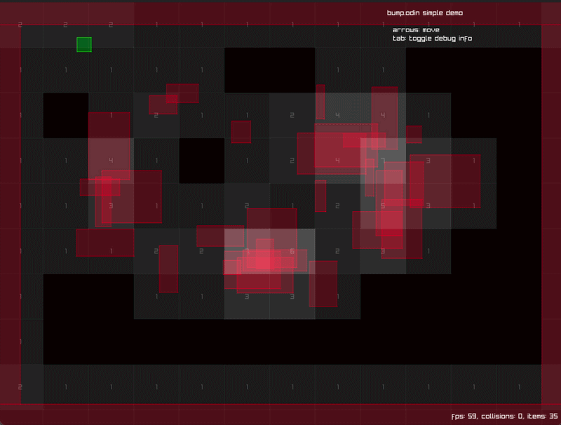

# bump.odin

An Odin port of [**bump.lua**](https://github.com/kikito/bump.lua), Enrique García
Cota's 2D AABB collision-detection library.

This is a port only. All credit for the design and algorithm goes to the original
author. See the upstream project for the full documentation, tutorials, and
background: <https://github.com/kikito/bump.lua>.

This was originally ported to a 2D engine with Odin, but might be useful to others
requiring this type of physics.

> **Status:** not a complete port yet — the basics are covered (world creation,
> add/remove/update, move/check/project, queries, and the slide/touch/cross
> responses), but some of bump.lua's API is still missing. Contributions welcome!

## Demo



## Usage

```odin
package main

import "bump"
import "core:fmt"

main :: proc() {
	world := bump.world_new()
	defer bump.world_destroy(world)

	// Add a player and a wall. world_add returns a generated ItemId.
	player, _ := bump.world_add(world, 0, 0, 16, 16)
	bump.world_add(world, 32, 0, 16, 16)

	// Try to slide the player to the right; it stops against the wall.
	actual_x, actual_y, cols, cols_len, _ := bump.world_move(world, player, 64, 0)
	defer delete(cols)

	fmt.printf("moved to %.0f, %.0f with %d collision(s)\n", actual_x, actual_y, cols_len)
	// => moved to 16, 0 with 1 collision(s)
}
```

A full graphical demo (the bump.lua example ported to raylib) lives in `main.odin`.

## License

MIT. This port retains the original bump.lua copyright; see [LICENSE](LICENSE).
